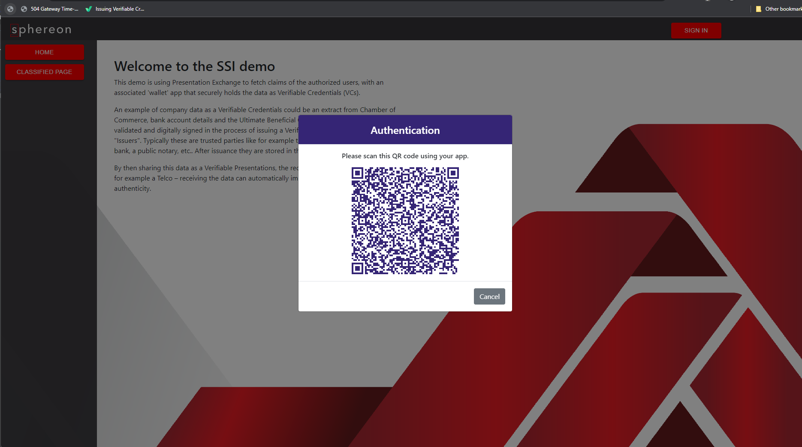
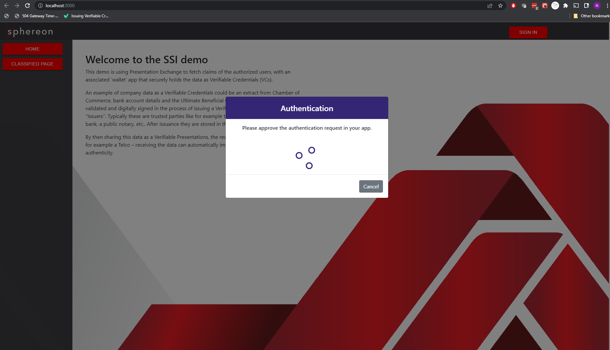
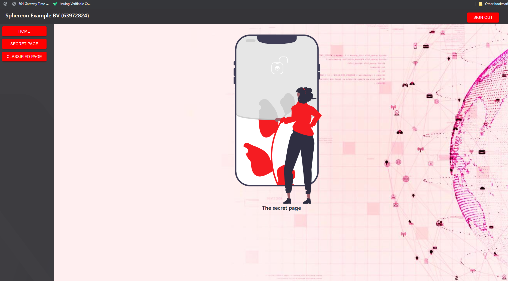

<h2 style="text-align: center; vertical-align: middle">
    <center><a href="https://www.sphereon.com"></a></center>

<br>SIOPv2 and OpenID4VP Example/Demo Website      
<br>
<br>
</h2>

#### This is a demo to showcase our ["Self Issued OpenID Provider v2 and OpenID4VP" library](https://github.com/Sphereon-Opensource/siopv2-openid4vp).

**NOTE: Please note, this is not intended as production code.
It is a quite simple implementation to show how the SIOPv2 and OpenID4VP technology can work.**

### Getting started

#### Configure environment

In the **./siopv2-openidvp-example-backend folder**, update the file called .env and populate it using .env as example. A valid
config will look like this

```dotenv
NODE_ENV=development
PORT=3002
COOKIE_SIGNING_KEY=8E5er6YyAO6dIrDTm7BXYWsafBSLxzjb
BASE_URL=https://nk-gx-compliance.eu.ngrok.io
AUTH_REQUEST_EXPIRES_AFTER_SEC=120
RP_PRIVATE_KEY_HEX=851eb04ca3e2b2589d6f6a7287565816ee8e3126599bfeede8d3e93c53fb26e3
RP_DID=did:ion:EiANaYB43B-E9ngU1Z9XLx8zgIJ6SdOcx74sjeeF7KSa2A
RP_DID_KID="did:ion:EiANaYB43B-E9ngU1Z9XLx8zgIJ6SdOcx74sjeeF7KSa2A#auth-key"
```

Except for the IP address/hostname in the `BASE_URL` this is a valid configuration to test with. You will need to replace it with the public IP
interface/address or ideally hostname where the
backend will be running and make sure it is accessible from your phone and the port is open in the firewall.

#### Build & start
We use pnpm. Currently you cannot use regular npm or yarn to build this project!
install pnpm globally using `npm -g install pnpm`

From the root directory
- pnpm install
- pnpm build
- pnpm start or pnpm start:dev

The server will start on port 5001, the client will start & open a browser on http://localhost:3000/

#### Usage

Once the demo site has loaded, you should see the following screen:


Click "Sign in"
A QR code will appear which can be scanned with the mobile OP authenticator module from our SSI-SDK.



Once the SIOP accepts the receipt of the Presentation Definition the screen will change to:


As soon as the SIOP sends in the Verifiable Presentation that conforms to the definition the SIOP will be authenticated:


Note the Information in the top left corner which actually comes from the Verifiable Credential sent by the SIOP.

app "[rn-did-siop-example-app](https://github.com/Sphereon-OpenSource/rn-did-siop-example-app)"
After a successful login two extra page will appear in the menu navigation.

#### Presentation Definition

Since this is just a demo. The Relying Party (Server) asks for a Credential from the SIOP containing a chamber of
commerce credential.
If you want to test it yourself you would need to issue/create a VC containing that info.

Of course you could also change the Server.ts file and adjust the fixed definition in there. We will make this a bit
more configurable soon.

Definition:

````json
{
  "id": "9449e2db-791f-407c-b086-c21cc677d2e0",
  "purpose": "You need to prove your Chamber of Commerce data to login",
  "submission_requirements": [
    {
      "name": "kvk",
      "rule": "Pick",
      "count": 1,
      "from": "A"
    }
  ],
  "input_descriptors": [
    {
      "id": "chamberOfCommerceSchema",
      "purpose": "checking the schema",
      "name": "kvkCredentialSchema",
      "group": [
        "A"
      ],
      "schema": [
        {
          "uri": "https://sphereon-opensource.github.io/vc-contexts/myc/bedrijfsinformatie-v1.jsonld"
        }
      ]
    }
  ]
}
````

Example VC:

````json
{
  "@context": [
    "https://www.w3.org/2018/credentials/v1",
    "https://sphereon-opensource.github.io/vc-contexts/myc/ubo-informatie-v1.jsonld"
  ],
  "credentialSubject": {
    "UBOInformatie": {
      "voornamen": "John",
      "achternaam": "Doe",
      "geboortedatum": "20-11-1988",
      "geboorteplaats": "Amsterdam",
      "geboorteland": "The Netherlands",
      "nationaliteit": "NL",
      "straatnaam": "Markt",
      "huisnummer": "76",
      "postcode": "1111 JA",
      "plaats": "Amsterdam",
      "politiekPersoon": "Nee",
      "uboBestuurder": "Ja",
      "directBelang": 20,
      "indirectBelang": 33,
      "geverifieerdePaspoort": "Ja",
      "geverifieerdeBankrekening": "Ja"
    },
    "id": "did:key:z6MkwFoX1bPNgU8iaNzNiC5c6V57PgSdX7Dztwt5tTeqa5UT"
  },
  "id": "df12af94-4a5e-48f0-b4b4-ced533c979aa",
  "issuanceDate": "2022-07-06T20:51:42.841Z",
  "issuer": "did:example:firm24",
  "type": [
    "VerifiableCredential",
    "UBOInformatie"
  ]
}
````

#### Docker

From the root folder run:

```bash
docker build -t siopv2-openidvp-example .
docker run -it -p 5001:5001 -p 3000:3000 onto-web-demo
```

### Docker compose

From the root folder run:

```bash
docker-compose up
```

