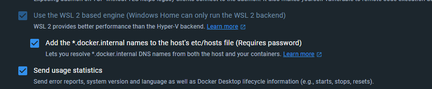

<h2 style="text-align: center; vertical-align: middle">
    <center><a href="https://www.sphereon.com"></a></center>

<br>Configurable OID4VC Issuer and Verifier Demo with branding support      
<br>
<br>
</h2>

#### This is a fully configurable demo to showcase our OpenID for Verifiable Credentials libraries and components.

It shows how OID4VC technologies, like SIOPv2 (peer to peer authentication), OID4VP (Verification), OID4VCI (Issuance)
end Presentation
Exchange (requirements by verifiers) work. You can create your own screen sequences, branding and credential types.

**Please note that this is a demo and not intended as production code.**


## Overview

In this document we're going to show you step by step what you have to do to setup your own VCI demo.

The demo consists of 2 components, which can be found in the packages folder.

- The agent using our [SSI-SDK](https://github.com/Sphereon-OpenSource/SSI-SDK), responsible for key-management, DIDs,
  Presentation Exchange storage, Issuer Metadata Storage, as well as
  actual issuance and verification of Credentials. It can handle multiple issuer configurations as well as
  Verifiers/Presentation definitions at the same time, although the frontends only will use one
- A Demo frontend, allowing you to fill out simple form(s), or using a wallet, to supply some information, which
  then will be used to issue a credential containing that information. The screens are configurable and you can create
  your own sequences. You can also change the look and feel and thus apply branding. This code can be exported and run
  on a regular
  webserver if you want. It is a frontend communicating with the agent, using some of our OID4VC SSI-SDK plugins.

The Demo is using code from our [SSI-SDK](https://github.com/Sphereon-OpenSource/SSI-SDK), providing 11 modules for
OID4VC, QR code generation, as well as Issuance branding. Integrating these technologies with a Key Management System,
DID methods etc. The OID4VC modules in the SDK in turn are using our less opinionated lower-level
libraries, allowing people to integrate OID4VC functionalities that do not desire full agent functionality, or have
their own agent support, like for
instance [Aries Framework Javascript](https://github.com/hyperledger/aries-framework-javascript).
Obviously integrating the low-level libraries will be a bit more work, but does bring flexibility.
The most prominent low-level libraries are:

- [OpenID for Verifiable Credential Issuance (client and issuer library)](https://github.com/Sphereon-Opensource/OID4VCI)
- [Self Issued OpenID v2 and OpenID for Verifiable Presentations](https://github.com/Sphereon-Opensource/SIOP-OID4VP)
- [Presentation Exchange v1 and v2](https://github.com/Sphereon-Opensource/PEX)

## Wallet Prerequisites

You will need an OID4VC capable wallet, that supports SIOPv2, OID4VP, OID4VCI and Presentation Exchange. You can use our
Open-Source wallet from the stores. You can see
our [Wallet demo instructions](https://sphereon.com/sphereon-products/sphereon-wallet/sphereon-wallet-demo-instructions/)
Here is a list of wallet's with above-mentioned capabilities:

- [Sphereon](https://github.com/Sphereon-Opensource/ssi-mobile-wallet)
- [Animo (Paradym)](https://github.com/animo/paradym-wallet)

A scenario for fetching a credential. Note that since the process is dynamic, your setup might be a little different,
but the main parts will stay the same.


And a scenario for using Verifiable Credential(s) For OID4VP flow:


# Step by Step instructions

In the next chapters we're going to show you how to setup the `agent` module, oid4vci-demo-front-end and a brief
introduction on how credential branding actually works.

- [Setting up the agent](./documents/agent-setup.md)
- [Setting up VCI frontend](./documents/vci-front-end.md)
- [Credential Branding](./documents/credential-branding.md)


### Linux

#### Docker
Make sure to have a default Docker installation

#### Clone repository

- Clone the repository:
```shell
git clone git@github.com:Sphereon-Opensource/OID4VC-demo.git 
```

#### Install the configuration files

We maintain Docker a setup for building and testing in directory `docker/compose/build`.
We have created a script to install and patch the agent configurations for you required to build and run the Docker
containers.

To run this script, you need to have `jq` installed on your machine. To install it, you can run:
```shell
sudo apt install jq
# to ensure that you have installed jq correctly, you can run the following.
jq -V
```

It's located here: `docker/compose/build/install-configs.sh <ecosystem> <agent host address>`.

**IMPORTANT:** The host address should be either a DNS host or a LAN IP that is reachable for your mobile devices running SSI wallet
software. For example:

```bash
./install-configs.sh sphereon http://192.168.x.x:5000
```

The install-configs.sh script will set up the environment for your containers using the .env.examples files from
packages/**src/.env.example and put them in the directories under `docker/compose/build`:

```
oid4vci-demo-frontend/.env.local
oid4vp-demo-frontend/.env.local
agent/.env.local
```

(The .env.local files are copied and patched from the packages/**/src/.env.example files)

Please ensure that you execute the script and docker compose commands with ./docker/compose/build as working directory
and have correctly set up your environment
variables as outlined in the documentation for [Setting up the agent](./documents/agent-setup.md)
and [Setting up the VCI frontend](./documents/vci-front-end.md).

The current example for ecosystem "sphereon" loads the folder `packages/agent/conf/demos/sphereon` as your base
configuration folder.
All ecosystems present in packages/agent/conf/demos can be installed using the install-configs.sh script.

To build and run the Docker containers, execute the following commands from within the respective directory:

#### Build the image and run the container

```bash
docker compose build # This builds the Docker images
docker compose up -d # This starts the Docker containers, this will require the .env & config files to be installed
```

The building process may take a few minutes. Once you execute the docker compose up command, three services will start:
ssi-agent, oid4vci-demo-frontend, and oid4vp-frontend.

You should now be able to go to http://localhost:5001 and http://localhost:5002 respectively to test the issuer and
verifier demo's.

Please note that you might have to configure your docker environment to expose the host.docker.internal like the image
below. If you cannot make that work you could adjust the config/docker and docker/compose/build/**/.env* files to suit
your needs.


To build the images without docker-compose you can also just use "docker build" in the project root directory with some
parameters:

```shell
docker build -f ./docker/Dockerfile -t oid4vc-demo-ssi-agent:latest --build-arg="PACKAGE_PATH=packages/agent" --build-arg="NODE_SCRIPT=start:dev" .
docker build -f ./docker/Dockerfile -t oid4vci-demo-frontend:latest --build-arg="PACKAGE_PATH=packages/oid4vci-demo-frontend" --build-arg="NODE_SCRIPT=start:prod" .
docker build -f ./docker/Dockerfile -t oid4vp-demo-frontend:latest --build-arg="PACKAGE_PATH=packages/oid4vp-demo-frontend" --build-arg="NODE_SCRIPT=start:prod" .
```

### Windows

#### Docker Desktop (WSL2)
Make sure to have an installation of Docker Desktop with the default options (recommended WSL2)

#### Clone repository

- Clone the repository:
```shell
# to not mess up the LF -> CRLF in the bash script
git config --global core.autocrlf false
git clone git@github.com:Sphereon-Opensource/OID4VC-demo.git 
```

#### Install the configuration files

We maintain Docker a setup for building and testing in directory `docker/compose/build`.
We have created a script to install and patch the agent configurations for you required to build and run the Docker
containers.

To build and run the Docker containers, execute the following commands from within the respective directory:

#### Build the image and run the container

- DOS shell:
```cmd
cd .\OID4VC-demo\docker\compose\build
docker compose build
docker run --name ubuntu-temp --rm -v C:/<path>/OID4VC-demo:/OID4VC-demo -w /OID4VC-demo/docker/compose/build ubuntu /bin/bash -c "apt update && apt install -y jq && ./install-configs.sh 'sphereon' 'http://192.168.x.x:5000'"
docker compose up -d
```

- make sure you do unmount the config & env files before running the install-configs.sh again
```shell
docker compose down
```
