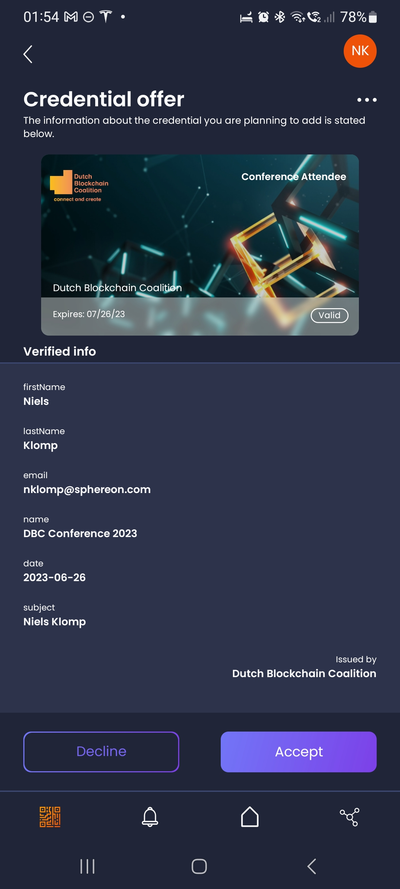

<h2 style="text-align: center; vertical-align: middle">
    <center><a href="https://www.sphereon.com"></a></center>

<br>OID4VC Issuer and Verifier Demo      
<br>
<br>
</h2>

#### This is a demo to showcase our OpenID for Verifiable Credentials libraries and components.

**Please note that this is not intended as production code. It is a relative simple implementation to show how the
OID4VC technologies, SIOPv2 (peer to peer authentication), OID4VP (Verification), OID4VCI (Issuance) end Presentation
Exchange (requirements by verifiers) work.**

The demo consists of 3 components, which can be found in the packages folder.

- The agent using our [SSI-SDK](https://github.com/Sphereon-OpenSource/SSI-SDK), responsible for key-management, DIDs,
  Presentation Exchange storage, Issuer Metadata Storage, as well as
  actual issuance and verification of Credentials. It can handle multiple issuer configurations as well as
  Verifiers/Presentation definitions at the same time, although the frontends only will use one
- A Demo Issuer frontend, allowing you to fill out a simple form, or using a wallet, to supply some information, which
  then will be used to issue a credential containing that information. This code can be exported and run on a regular
  webserver if you want. It is a frontend communicating with the agent, using some of our OID4VC SSI-SDK plugins.
- A Demo Verifier frontend, allowing you to verify the Credential issued by the agent (the demo issuer, also contains
  similar functionality if you would follow the wallet flow btw). Be aware that we will replace this demo frontend with
  something a bit more appealing soon.

The Demo is using code from our [SSI-SDK](https://github.com/Sphereon-OpenSource/SSI-SDK), providing 11 modules for
OID4VC, QR code generation, as well as Issuance branding. Integrating these technologies with a Key Management System,
DID methods etc. The OID4VC modules in the SDK in turn are using our less opinionated lower-level
libraries, allowing people to integrate OID4VC functionalities that do not desire full agent functionality, or have
their own agent support, like for
instance [Aries Framework Javascript](https://github.com/hyperledger/aries-framework-javascript).
Obviously integrating the low-level libraries will be a bit more work, but does bring flexibility.
The most prominent low-level libraries are:

- [OpenID for Verifiable Credential Issuance (client and issuer library)](https://github.com/Sphereon-Opensource/OID4VCI)
- [Self Issued OpenID v2 and OpenID for Verifiable Presentations](https://github.com/Sphereon-Opensource/SIOP-OID4VP)
- [Presentation Exchange v1 and v2](https://github.com/Sphereon-Opensource/PEX)

## Wallet Prerequisites

You will need an OID4VC capable wallet, that supports SIOPv2, OID4VP, OID4VCI and Presentation Exchange. You can use our
Open-Source wallet from the stores. See our wallet [Github](https://github.com/Sphereon-OpenSource/ssi-mobile-wallet) or
our [Wallet demo instructions](https://sphereon.com/sphereon-products/sphereon-wallet/sphereon-wallet-demo-instructions/)

## Issuer demo

If you run `pnpm run start:dev` the Issuer frontend, the verifier frontend and the agent will be started. Your browser
should automatically
open https://localhost:5001. You can also go to https://ssi.sphereon.com/demo/issuer, for an online hosted
demo. https://ssi.dutchblockchaincoalition.org/demo/issuer, https://ssi.triall.io/demo/issuer hosts different integration/use cases you can test with.

You should be greeted with the introduction screen


There are 2 flows. One is a manual flow, where you will fill out some information (the information will not be
shared/stored) in order to receive a credential. The other flow is using your wallet to request the information
required (SIOPv2/OID4VP). Obviously the demo is having a few more screens than strictly necessary, just to show the
different steps involved.

The flow should be pretty self-explanatory. In the end your wallet should end up with a credential-offer that you can
accept or decline:



## Verifier demo

Next to the Issuer frontend, the verifier frontend will also be started with the `pnpm run start:dev` command. Your
browser
should automatically
open https://localhost:5002. You can also go to https://ssi.sphereon.com/demo/verifier, for an online hosted
demo. https://dutchblockchaincoalition.org/userLogin hosts an integration into the DBC website and Craft CMS.

You should be greeted with the introduction screen


Click "Sign in"
A QR code will appear which can be scanned with the mobile SIOPv2/OID4VP OP authenticator module from our SSI-SDK.


It will ask for a certain type of credential, you should now have in your wallet


Once the SIOP accepts the receipt of the Presentation Definition the screen will change to:


As soon as the SIOP sends in the Verifiable Presentation that conforms to the definition the SIOP will be authenticated:


Note the Information in the top left corner which actually comes from the Verifiable Credential sent by the SIOP.

## Developers

#### Configure environment

In the `./packages/agent`, `./packages/oid4vci-demo-frontend`, `./packages/oid4vp-demo-frontend` directories copy the
file called .env to .env.local and populate it using .env as example. A valid
config will look like below. Not all properties are listed.

**agent .env.local**

```dotenv
NODE_ENV=local
HOSTNAME=0.0.0.0 # bind to all network adapters
PORT=5000 # The port to use
DB_ENCRYPTION_KEY=29739248cad1bd1a0fc4d9b75cd4d2990de535baf5caadfdf8d8f86664aa830c # The key used to encrypt certain database fields
OID4VP_ENABLED="true" # Whether to enable OpenID for Verifiable Presentations
OID4VP_WEBAPP_BASE_URI=http://192.168.2.90:5000 # The base URL of the webapp. This will be communicated in the QR code. Please use an IP or hostname that is resolvable from your wallet
OID4VP_AGENT_BASE_URI=http://192.168.2.90:5000 # The base URL of the agent. Please use an IP address, or hostname that is resolvable from you wallet
AUTH_REQUEST_EXPIRES_AFTER_SEC=180 # How long to keep a session alive. You need to finish the auth with a certain QR code /deeplink in this time
CONF_PATH="./my-config-path" #Allows you to set a custom configuration path
```

**oid4vci-demo-frontend .env.local**

```dotenv
REACT_APP_ENVIRONMENT=sphereon # The branding and built in credential defnitions and metadata to use. Supported values: sphereon, dbc, triall, fmdm, energyshr
PORT=5001 # The port to use when running pnpm run start:dev. Please note that you can also build the project, and host it on a regular webserver.
```

**openid4vp-demo-frontend .env.local**

```dotenv
REACT_APP_QR_CODE_EXPIRES_AFTER_SEC=300 # How long with the authentication session be valid
REACT_APP_PRESENTATION_DEF_ID=sphereonGuest # The presentation definition ID supported by the SSI-SDK agent (the agent can support multiple definitions)
REACT_APP_BACKEND_BASE_URI=http://192.168.2.90:5000 # The base URL of the agent, needs to be resolvable by the wallet! 
PORT=5002 # The port to use when running pnpm run start:dev. Please note that you can also build the project, and host it on a regular webserver.
```

#### Build & start

We use pnpm. Currently you cannot use regular npm or yarn to build this project!
install pnpm globally using `npm -g install pnpm`

From the root directory

- pnpm install
- pnpm build
- pnpm start:dev

The server will start on port 5000, the client will start & open a browser on http://localhost:5001/ for the issuer
and https://localhost:5002 for the verifier

#### Usage

Once the demo site has loaded, you should see the following screen:

### Docker

From the root folder run:

```bash
docker-compose build
docker-compose up
```

The build phase might take a few minutes. If you run the docker-compose up command 3 services will be running. The ssi-agent, oid4vci-demo-frontend and oid4vp-frontend.

You should now be able to go to http://host.docker.internal:5001 and http://host.docker.internal:5002 respectively to test the issuer and verifier demo's.

Please note that you might have to configure your docker environment to expose the host.docker.internal like the image below. If you cannot make that work you could adjust the config/docker and docker/*.env files to suit your needs


#### Environment variables and configuration for docker.
Please note that the environment variables for the 3 images come from the ./docker folder. You will have to copy the 3 example files and remove the .example suffix.

The configuration files are copied over to the agent image. So the above explained configuration options also apply when running in docker.
