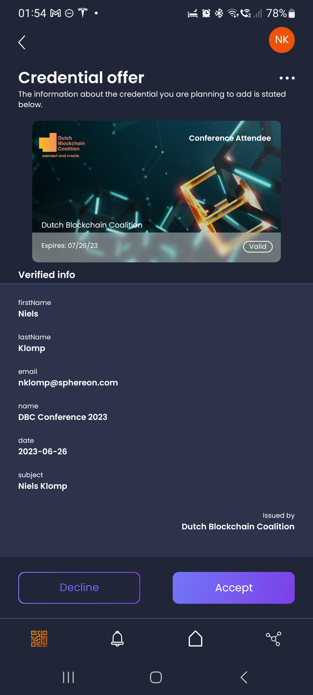

<!--suppress HtmlDeprecatedAttribute -->
<h1 align="center">
  <br>
  <a href="https://www.sphereon.com"></a>
  <br>OID4VC demo's credential branding 
  <br>
</h1>

---

## Table of contents

1. [Credential Branding in Verifiable Credentials](#credential-branding-in-verifiable-credentials)
2. [Definition and Purpose](#definition-and-purpose)
3. [Metadata Parameters](#metadata-parameters)
4. [Branding in real-world](#branding-in-real-world)

## Credential Branding in Verifiable Credentials

Credential branding is an essential aspect of Verifiable Credentials (VCs) that helps define how a credential is displayed and identified to end-users. It plays a crucial role in creating a user-friendly and consistent experience for individuals who interact with verifiable credentials. In this explanation, we give you a detailed account of the concept of credential branding as defined in the [Verifiable Credentials Issuance (VCI) spec](https://openid.net/specs/openid-4-verifiable-credential-issuance-1_0.html) specification.

An example of a branded credential in the Sphereon wallet:




## Definition and Purpose

In the context of VCs, "Credential Branding" refers to the visual and descriptive attributes associated with a credential, including its name, logo, background color, and more. These attributes are defined in the metadata of the credential issuer and are used to present the credential in a consistent and nice way to the credential holder or verifier.

## Metadata Parameters

Credential branding is specified using various parameters in the metadata of a credential issuer. Here are some metadata parameters related to credential branding:

- **Display (OPTIONAL):** An array of objects, where each object contains the display properties of the supported credential for a specific language. Display properties include the credential's name, logo, background color, and more. Each language-specific display object helps create a localized credential presentation.

    - **Name (REQUIRED):** A string value representing the display name for the credential.

    - **Locale (OPTIONAL):** A string value that identifies the language of the display object, represented as a language tag (e.g., "en-US" for English). Multiple display objects can be included for different languages.

    - **Logo (OPTIONAL):** A JSON object with information about the logo of the credential. This object may include:
        - **URL (OPTIONAL):** The URL where the wallet or verifier can obtain the credential's logo from the credential issuer.
        - **Alt Text (OPTIONAL):** A string value serving as alternative text for the logo image.

    - **Description (OPTIONAL):** A string value providing a description of the credential.

    - **Background Color (OPTIONAL):** A string value representing the background color of the credential, specified using numerical color values defined in CSS Color Module Level 3.

    - **Text Color (OPTIONAL):** A string value representing the text color of the credential, specified using numerical color values defined in CSS Color Module Level 3.

## Branding in real-world

We're using branding in this project. So in order to get familiar with it, you can visit one of our config json files in [packages/agent/conf/examples/oid4vci_metadata](./agent-setup.md#2-oid4vci_metadata). You can find the branding related information (as the spec suggests in `credentials_supported` field of the metadata)
Here is a real world example of a credential branding:
```json
{
  ...,
  "credentials_supported": [
    {
      "display": [
        {
          "name": "Conference Attendee",
          "description": "The DBC Conference Attendee credential is given to all visitors of the DBC conference.",
          "background_color": "#3B6F6D",
          "text_color": "#FFFFFF",
          "logo": {
            "url": "https://dutchblockchaincoalition.org/assets/images/icons/Logo-DBC.png",
            "alt_text": "An orange block shape, with the text Dutch Blockchain Coalition next to it, portraying the logo of the Dutch Blockchain Coalition."
          },
          "background_image": {
            "url": "https://i.ibb.co/CHqjxrJ/dbc-card-hig-res.png",
            "alt_text": "Connected open cubes in blue with one orange cube as a background of the card"
          }
        }
      ],
      ...
    }
  ],
  ...
}
```

When providing image for branding, be sure that:
1. The image (both `background_image.url` and `logo.url`) are available to every party interacting with the demo.
2. You will have to provide a rectangular image for background image of credential cards, without rounded corners, the library will take care of that.
3. Locale-Specific Branding: To cope with different languages and regional preferences, our system allows for locale-specific customization of credentials. You can define these customizations within the `display` array by including a `locale` key to specify the language (following BCP47 [RFC5646](https://datatracker.ietf.org/doc/html/rfc5646) standards). This flexibility means that not only can the display name of the credential (`display.name`) be localized, but any claim within the credential can also have a locale-specific display name (`claims.display.name`). This enables the presentation of credentials in the user's preferred language.
For instance, if your credential includes a "firstName" this can be displayed in English, Spanish, French, or any other supported language based on the locale you specify. Each locale can have its distinct display properties, ensuring that users see the credential information in their own language. The array can include multiple objects for different locales, with the condition that each language identifier must be unique within the array.
Beyond names and claim labels, other optional branding elements can be locale-adapted too, such as:
  - `logo`: Provide a URL for the wallet to fetch a locale-specific logo, along with alternative text and a description.
  - `background_image`: Provide a URL for the wallet to fetch a locale-specific background image, along with alternative text and a description.
  - `description`: Offer a localized description of the credential.
  - `background_color` and `text_color`: Set locale-specific colors for the credential's background and text, ensuring that the visual presentation aligns with the language and regional norms.

By utilizing these customizable display options, you can enhance the user experience with a display that is both visually and linguistically tailored to requirements of your user. Read more details in the [OID4VCI specification](https://openid.net/specs/openid-4-verifiable-credential-issuance-1_0.html#section-10.2.3.1-2.5.1).
